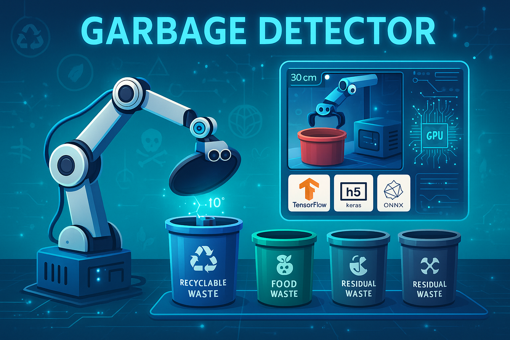

♻️ Garbage Detector: Real-Time Waste Detection & Classification System
A real-time Waste Detection & Classification System that combines cutting-edge computer vision, deep learning ensembles, and Arduino-driven hardware to automatically sort trash into the correct bins — hands-free.

🚀 Key Highlights

🔍 Real-time detection & classification with >95% accuracy
🧠 Supports Keras, TensorFlow, ONNX, and TFLite models — single or ensemble
🧪 Built for Windows 11 with GPU + Intel oneAPI acceleration
🎛️ Servo motors & ultrasonic sensor for automatic sorting
🎨 Sleek OpenCV-powered GUI with remote streaming
🗣️ Real-time text-to-speech (TTS) feedback
🧩 Highly modular, optimized with SIMD, Cython, and dynamic batching
🛠️ Easy to extend and integrate with new sensors or models
